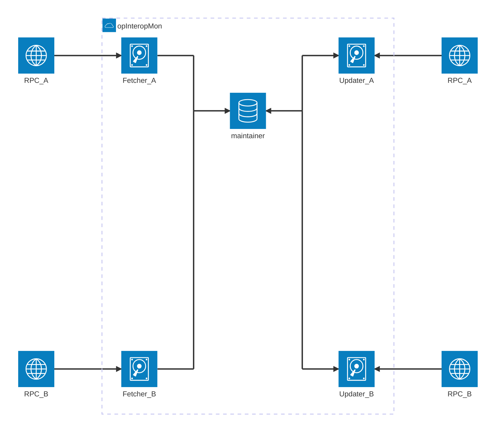

# Optimism Interop Monitor

## Purpose
The Optimism Interop Monitor is a service that monitors Executing Messages between OP Protocol chains to detect and report any invalid messages on chains. It helps ensure the reliability and correctness of cross-chain communication.

Interop Monitor's primary output is a collection of metrics which can alert operators for fast response and insight.
The design of this service follows the [Design Doc](https://github.com/ethereum-optimism/design-docs/pull/222),
and boilerplate structure was pulled from the adjacent `op-dripper`.

## Architecture
The service consists of several key components working together:

- A main service (`InteropMonitorService`) that coordinates everything
- A set of RPC Clients specified from command line, and given to each sub-component
- Multiple `Finder` instances that scan chains for relevant transactions
- Multiple `Updater` instances that take `job`s for their chain and update them
- A `Maintainer` that processes and tracks the state of Executing Messages
- Metrics reporting for monitoring and alerting

The components communicate through channels and maintain state about message status.

## Maintainer
The `Maintainer` is responsible for routing `job`s to updaters, and collecting metrics. It:

- Receives `job`s from Finders
- Sends `job`s to appropriate updaters
- Collects all `job`s from updaters during Metric Collection
- Emits Metrics after evaluating all `job`s

### Updaters
`Updater`s are chain specific processors that take `job`s and update them. They can be used to batch requests and run in parallel, but
are currently built naively. Each Updater:
- Enqueues new `job`s to an inbox
- Maintains a map of all `job`s it is updating
- Evaluates all `job`s regularly
- Expires old `job`s
- Operates independently per chain

## Finders
`Finder`s scan individual chains for relevant transactions. Each Finder:

- Subscribes to new blocks on its assigned chain
- Processes block receipts to identify Executing Messages
- Creates `job`s for each relevant transaction found
- Sends `job`s to the Maintainer for tracking
- Operates independently per chain

## Jobs
`job`s represent individual Executing Messages that need to be tracked. A `job` contains:

- Timestamps for first/last seen
- Transaction hashes and Initiating/Executing identifiers
- Current status and status history
- More, as needed by the service

`job`s move through different states (unknown -> valid/invalid/missing) as the Maintainer processes them.
